# Trabajo Práctico N°2: Finanzas 
# Vidman Xavier Harry

---

# Obtención de los datos de cada empresa

## Comenzamos obteniendo los símbolos de cada empresa a través de la URL de wikipedia: https://en.wikipedia.org/wiki/List_of_S%26P_500_companies

---
# Descargamos todos los datos de cada empresa, en formato .csv, de la database de Yahoo Finance. 

# Luego se concatenan para crear un solo DataFrame con toda la información
---
# DataFrame de las empresas de S&P500

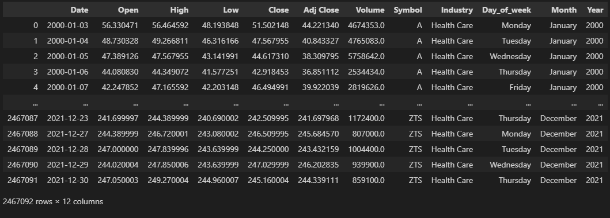

---
# Calculamos los índices financieros y los agregamos como columnas al dataframe

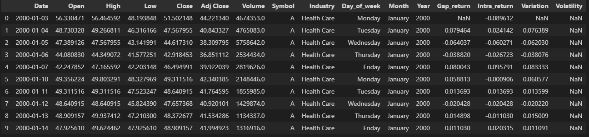

---

# ¿Cuál es el mejor día para invertir teniendo en cuenta el retorno de los movimientos gap?¿Y el movimiento intradiario?

---

# Graficos de los días de la semana

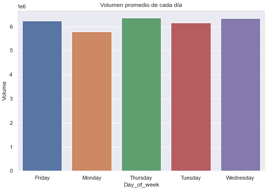    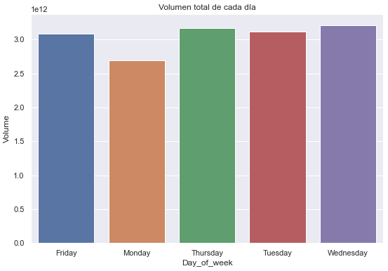

---

# Graficamos la media del "Retorno de gap" para cada día de la semana. Vemos que el mejor día es el MARTES

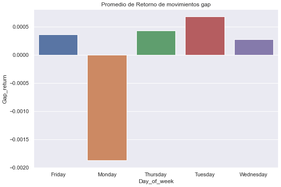

---

# Graficamos la media del "Retorno intradiario" para cada día de la semana. Vemos que el mejor día es el JUEVES

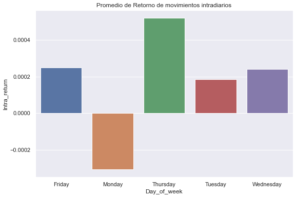

---

# ¿Cuáles son las mejores industrias que pertenecen al S&P500 en las cuales se puede invertir?

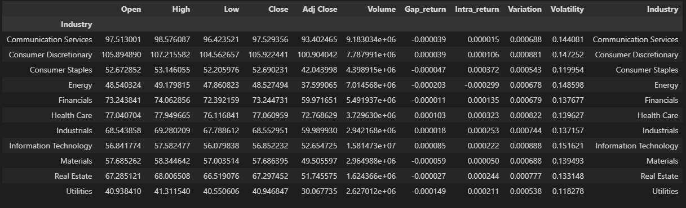

---

# Retorno medio de gap de cada industria

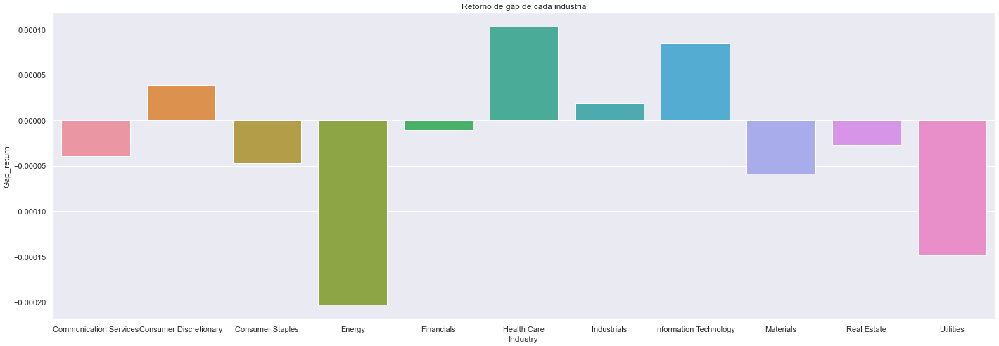

---

# Mejores industrias: "Retorno intradiario" y "Retorno Gap", de media, POSITIVOS. 

## Consumer Discretionary 
## Health Care Industry 
## Industrials 
## Information Technology

---

# Retorno medio intradiario de cada industria

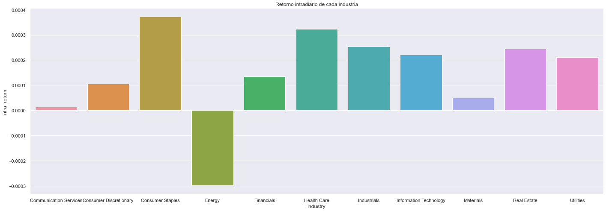

---

# ¿Cuáles son las 9 mejores empresas para invertir?
## Sumamos las columnas del DataFrame, agrupando por Symbol y Year

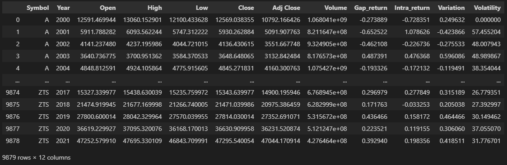

---

# Calculamos la diferencia entre los Retornos del 2021 y 2020

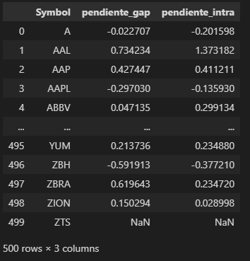

---

# Filtramos las mejores empresas con pendiente_gap y pendiente_intra

## Luego, nos quedamos con las 9 de mayor volumen

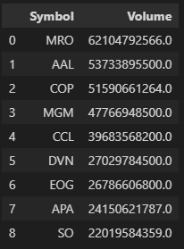

---

# Fin
# ¡Muchas Gracias!
